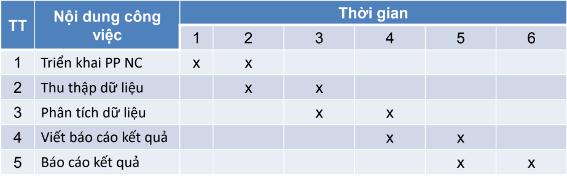
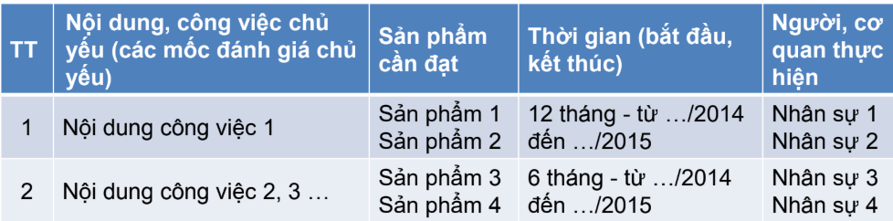
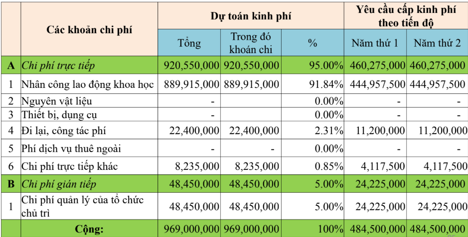

# Note:
làm đề cương tốt thì luận văn tốt
Nên sử dụng liner thinking

# PHƯƠNG PHÁP VIẾT ĐỀ CƯƠNG NCKH
2.3.1. Mục đích viết đề cương NCKH 
2.3.2. Các bước viết một đề cương NCKH 
2.3.3. Hướng dẫn chi tiết viết một đề cương 
NCKH mẫu 

# Phương pháp viết đề cương NCKH
Mục tiêu:
1: Giúp người nghiên cứu trình bày tư duy (tầm 10 trang) của người NC 1 cách logic thuyết phục
2: Là cơ hội để sắp xếp ý tưởng có hệ thống
3: Tạo cơ sở để hội đồng KH phê duyệt, thông qua và xin kinh phí.
4: Là cơ hội tham khảo, cập nhật thông tin, nhận ý kiến đồng nghiệp, chuyên gia.
5: Giúp chọn được đề tài, mục tiêu, phạm vi, phương pháp thích hợp.
6: Giúp dự trù, phân bổ nguồn lực hợp lý, lường trước tình huống xảy ra.
7: Giúp xác định phương án triển khai NC một cách có kế hoạch, khung thời gian.
8: Giúp trau dồi kỹ năng viết.

# Các bước viết một đề cương NCKH
Mẫu 1: 7 bước
1: Mở đầu: Tên đề bài, đặt vấn đề:
- Mục đích NC (định tính): Tổng quan tài liệu -> research gap
- Mục tiêu NC( định lượng): để giải quyết research gap : xác định đối tượng và phạm vi NC
- Mục lục dự kiến của báo cáo kết quả NC.

2: Cơ sở lý thuyết tóm gọn (liên quan đến đề tài);
3: Nội dung NC & PP NC (thực nghiệm, phi thực nghiệm, …);
PP ứng với nội dung của mục tiêu nghiên cứu
4: Dự kiến kết quả nghiên cứu đạt được: Dựa vào nội dung dự
kiến kết quả; Ý nghĩa khoa học/lợi ích mang lại/ tác động của
kết quả NC
5: Kế hoạch thực hiện: Nhân sự, mốc thời gian, trách nhiệm, kết
quả đạt được;
Hợp tác quốc tế (nếu có)
6: Phác thảo kinh phí cần thực hiện (nếu có); (Luận văn bỏ phần này)
7: Tài liệu tham khảo và các phụ lục (nếu có)
nếu giả sử có code hoặc thuật toán dài -> bê xuốn dưới phụ lục mà đọc

Mẫu 2:
1: Mở đầu:Tên đề tài, Đặt vấn đề; Mục đích NC (định tính); (cảm giác không liền mạch, cần dựa vào mục số 2, ví dụ: mục research gap tóm tắt ở mục số 2 là: ...)
- Mục tiêu NC (định lượng); Đối tượng và Phạm vi NC;
- Mục lục dự kiến của báo cáo kết quả NC
2: Tổng quan tài liệu; (Cắt phần tổng quan tài liệu sang bước số 2 này)
3: Cơ sở lý thuyết tóm gọn (liên quan đến đề tài);
4: Nội dung NC và PP NC (thực nghiệm, phi thực nghiệm, …);
5: Dự kiến kết quả nghiên cứu đạt được: Dựa vào nội dung dự
kiến kết quả;
Ý nghĩa khoa học/lợi ích mang lại/ tác động của kết quả NC
6: Kế hoạch thực hiện: Nhân sự, mốc thời gian, trách nhiệm, kết
quả đạt được
Hợp tác quốc tế (nếu có)
7: Phác thảo kinh phí cần thực hiện (nếu có);
8: Tài liệu tham khảo và các phụ lục (nếu có).

# HƯỚNG DẪN CHI TIẾT VIẾT MỘT ĐỀ CƯƠNG NCKH MẪU 
a.Tên đề tài
• Tên đề tài đơn nghĩa, rõ ràng, ngắn gọn, cô đọng vấn đề
nghiên cứu; chuyên biệt, không trùng lặp với tên các đề tài
khác, không tạo sự hiểu lầm, hiểu theo nhiều nghĩa khác nhau
hay hiểu mập mờ.
• Có điểm mới, có từ khóa (keyword)
• Có phạm vi nghiên cứu rõ ràng, tránh đề tài quá rộng hoặc
quá chung chung
• Vấnđề được nghiên cứu phải có giá trị khoa học và thực tiễn
• Phải phù hợp với mã ngành đào tạo (đối với luận văn ThS,
NCS)

b.Tính cấp thiết, mục đích nghiên cứu, tổng quan tài liệu 
• Nêu vấn đề tổng quan bao phủ NC dự định tiến hành. Nhanh chóng thu
hẹp vấn đề theo hướng tiếp cận mục đích NC (chú ý nhu cầu thực tế của
XH, hiện trạng NCKH liên quan (nếu có), và số liệu định lượng minh họa
thuyết phục về quy mô, nhu cầu, dự báo, các mối quan hệ tương quan
v.v);
• Chỉ rõ mục đích của nghiên cứu này (mang tính định tính) nhằm giải quyết
vấn đề gì cho NCKH hoặc cho thực tiễn;
• Tómlược những kết quả đã công bố trước đây liên quan đến NC dự định
tiến hành. Nêu rõ những vấn đề còn tồn tại cần NC tiếp (theo hướng tiếp
cận mục tiêu NC)? Cần chú ý cách trích dẫn tài liệu tham khảo;
• Chỉ ra được khe hẹp NC “research gap” (liên quan trực tiếp đến giả thuyết
NC)

c. Mục tiêu NC (định lượng), đối tượng và phạm vi nghiên cứu 
• Xác định một số mục tiêu cụ thể (nội dung NC) cần thực hiện
để đạt mục đích NC. Cần phân biệt rõ sự khác nhau giữa mục
đích và mục tiêu NC.
• Mục đích mang tính định tính nhằm trả lời câu hỏi “NC để làm
gì”?
• Mục tiêu mang tính định lượng nhằm trả lời câu hỏi “Làm cái
gì, làm thế nào?”
• Nghiên cứu được tiến hành trên đối tượng nào?
• Phạmvi nghiên cứu (không gian nào? thời gian nào?)

d. Mục lục dự kiến của báo cáo kết quả NC: 
Trình bày nội dung mục lục chính:
Chương
1: Mở đầu (Đặt vấn đề, Tổng quan tài liệu, Mục đích, mục
tiêu, đối tượng và phạm vi NC)
Chương
2: Cơ sở lý thuyết (Cơ sở lý thuyết 1, cơ sở lý thuyết 2,
…) -> nhớ lưu ý tóm tắt lại và để vào
Chương
3: Phương pháp nghiên cứu (Phương pháp triển khai
để thu thập dữ liệu, phương pháp trình bày số liệu, …)
Chương
4: Kết quả và thảo luận
Chương
5: Kết luận và hướng phát triển đề tài
Tài liệu tham khảo & Phụ lục (nếu có)

Bước 2: Cơ sở lý thuyết 
• Là các giả thuyết khoa học đã được kiểm chứng và
khẳng định, có liên quan trực tiếp đến đề tài NCKH;
• Là cơ sở khoa học để thực hiện đề tài => Đòi hỏi NCV
phải nắm vững để có đủ cơ sở và lý luận khoa học
nhằm thực hiện tốt đề tài và bảo vệ kết quả thực hiện đề
tài.
• Để nghiên cứu tốt (cả rộng và sâu), NCV cần nắm vững
cả cơ sở lý thuyết được trình bày trong đề cương cũng
như các cơ sở lý thuyết khác có liên quan

• Khi viết cơ sở lý thuyết cần chú ý các điểm sau:– Viết lại ngắn gọn, có sự khác biệt nhất định với các
phiên bản trước đó, trích dẫn rõ ràng.– Tạo sự khác biệt bằng việc thêm các bình luận: điểm
mạnh, điểm sâu sắc, điểm hạn chế …– Cũng có thể tạo sự khác biệt bằng thay đổi các ký hiệu
công thức– Hình vẽ cần được tạo mới, tránh việc dùng y nguyên
hình vẽ gốc
Chú ý: Không được copy nguyên si các kiến thức nền
từ các phiên bản trước đó (tránh “đạo văn- plagiarism”)

Bước 3: Nội dung nghiên cứu và Phương pháp nghiên cứu
• Nêu tên nội dung NC và việc vận dụng các PP NC tương ứng để triển
khai.
• Cầnchỉ rõ môhình NC là thực nghiệm hay phi thực nghiệm.
• Nếu là thực nghiệm, cần mô tả thí nghiệm sẽ triển khai, chỉ rõ khung
mẫu, đối tượng khảo sát, cỡ mẫu (nếu có), thí nghiệm trên mẫu, và cách
thu thập dữ liệu.
• Nếu là phi thực nghiệm, cần mô tả khung mẫu, đối tượng khảo sát, cỡ
mẫu (nếu có PP) và cách thiết kế các bảng câu hỏi để thu thập số liệu.
• Nêu phương pháp xử lý, phân tích số liệu, và cách kết luận giả thuyết
NC.
• Tác giả cần trình bày kỹ để người đọc hình dung rõ nội dung và PP NC
cụ thể, thuyết phục người đọc về tính KH, logic và khả thi của việc triển
khai đề tài NC

Bước 4: Dự kiến kết quả nghiên cứu đạt được
• Dựkiến kết quả (viết theo từng nội dung NC)
• Cần trình bày ý nghĩa khoa học hoặc/và ý nghĩa
thực tiễn hoặc tác động của kết quả nghiên cứu đến
khoa học và thực tế

Bước 5: Kế hoạch thực hiện
NCV cần trình bày những việc làm cụ thể trong từng giai đoạn / thời kỳ, những hoạt động nào tiến hành trước/sau? Thời
gian dự kiến cho từng hoạt động là bao lâu?

Đối với đề cương đề tài NCKH có yêu cầu tài chính và có
nhiều NCV tham gia. Tác giả cần trình bày rõ nội dung công
việc cụ thể trong từng giai đoạn (có mốc thời gian cụ thể), sản
phẩm cụ thể, mốc thời gian cụ thể, nhân sự tham gia.

Bước 6: Phác thảo kinh phí cần thực hiện (nếu có) (Luan van se khong co)

Bước 7: Tài liệu tham khảo và các phụ lục (nếu có)

NCV cần trình bày đúng theo mẫu hướng dẫn. Ví dụ
1. H. V. Khuong, “Exact outage analysis of underlay cooperative cognitive
networks with maximum transmit-and-interference power constraints and
erroneous channel information,” Trans. Emerging Telecommun. Technol., vol.
24, no. 7−8, pp. 772−788, Nov. 2013. (Journal Paper)
2. B. Vucetic and J. Yuan, Space-time coding, John Wiley & Sons, Inc., 2003.
(Book)
3. H. V. Khuong, “On the performance of underlay cooperative cognitive networks
with relay selection under imperfect channel information, in Proc. IEEE ICCE,
DaNang, Vietnam, Aug. 2014, pp. 144−149. (Conference Paper)
4. FCC, Spectrum policy task force report, ET Docket 02−135, Nov. 2002.
(Technical Report)

5. https://thanhnien.vn/tai-chinh-kinh-doanh/khong-ung-tien-cua-vingroup-de-sua-
duong-nguyen-huu-canh-1009774.html (Web)

Ví dụ đề cương (thuyết minh) đề tài NCKH

04 Mau NCCB02 - TMDC phan 1.doc

DT_Thuyet-minh-VNU-cap-nhat-theo-TT55-final.docx

Ví dụ đề cương LV
De cuong luan van - physical layer security with relay selection.docx

# Chuan bi viet bao cao De cuong De tai va De cuong Luan Van
